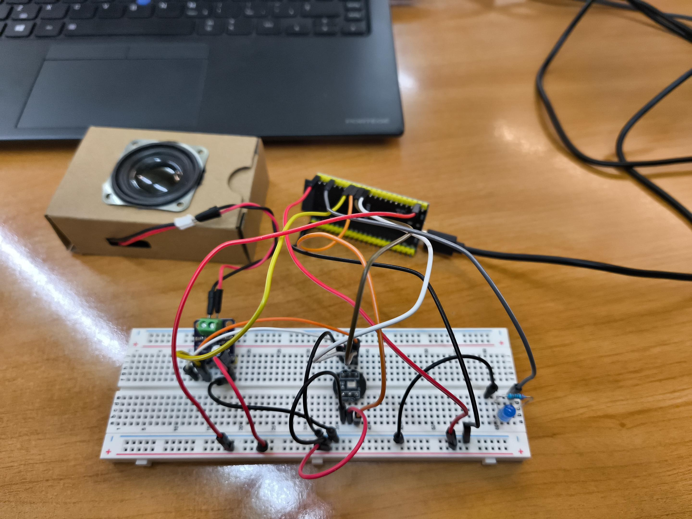

# These are the steps to install and execute voice ai assistant version 2.3 (led version)

## Hardware components:
-ESP32-S3 x(1)\
-MAX98357 I2S 3W DAC x(1)\
-speaker 3W 4Ω JST\
-INMP441 MEMS 24-bit I2S\
-capacitor 10uF or 100uF\
-Breadboard\
-wires male/male & male/female\
-led\
-220Ω resistor

## Software components:
-Python backend (fastApi & webSocket)\
-Azure OpenAI services\
-Azure Cognitive Search (vector DB) services\
-Azure Speech (STT + TTS) services\
-ESP32 code

## Steps to install:
1. Save requirements.txt and server.py on the local computer
2. Install dependencies listed on requirements.txt
3. Execute serve.py with this command:python -m uvicorn server:app --host 0.0.0.0 --port 8000 --ws websockets --ws-max-size 16777216 (visual studio)
4. Check local IP with ipconfig (CMD).
5. Install Arduino IDE
6. Save voice_ai_v2_3 on the local computer
7. Open voice_ai_v2_3 with Arduino IDE, update field host with local IP and ssid & password with local Wi-Fi credentials
8. Flash ESP32 with voice_ai_v2_3 
9. Wait for warm-up process and use

## Hardware configuration:

- led (longer leg) -> PIN 4 
- I2S ws (mic & speaker) -> PIN18
- I2S sd (mic) -> PIN16
- I2S sck (mic & speaker) -> PIN17
- I2S dout (speaker) -> PIN15
- Capacitor in vvc MAX98357
- resistor in data (4) led
